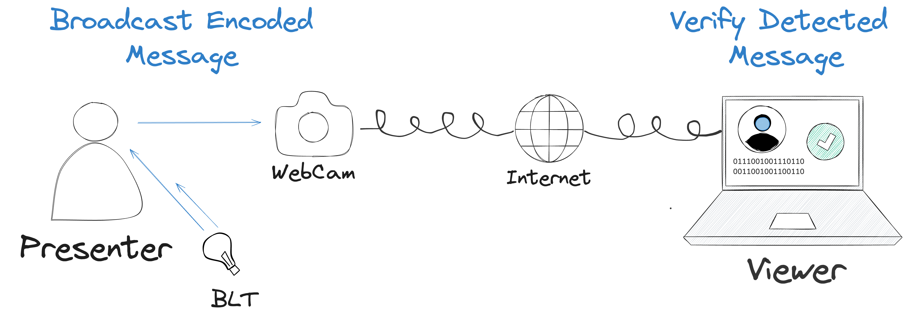
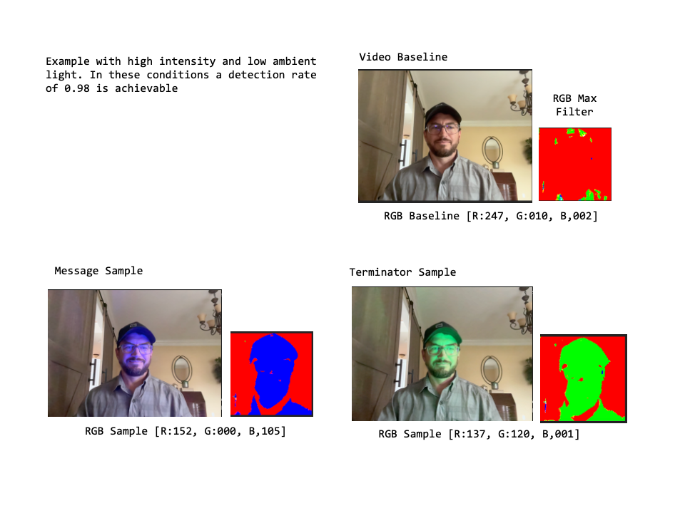
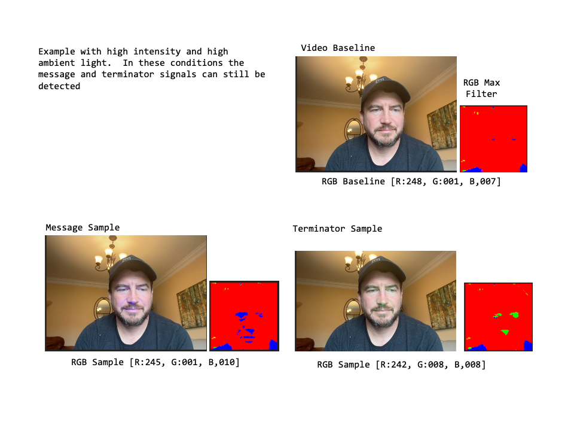
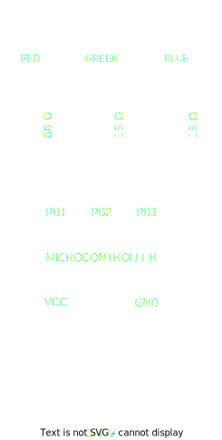

---
authors:
  - jamescbury
  - ankmister
  - patmac
date:
  created: 2024-08-01
  updated: 2024-09-24
draft: false
categories:
  - Attestation
tags:
  - live streaming
comments: true
---

# Blinky Light Thing: An Approach for Verifiable Real-Time Video

Zeroth Technology, Inc

- James Canterbury
- Patrick Macom
- Ankur Garg

<https://zeroth.technology>

August 1st, 2024

## Executive Summary

This white paper introduces the Blinky Light Thingy (BLT), a novel approach for real-time video authentication in live-streaming environments. The BLT embeds cryptographic messages into the physical environment being recorded, making it difficult to modify the video feed in real-time and avoiding the reliance on specialized trusted hardware. This approach addresses the growing challenge of distinguishing between authentic and generative content, particularly in the context of live video streams where it is becoming more common place for someone to "wear" the filter of another person and perpetuate fraud in what is typically considered a trusted environment. By utilizing Ethereum Attestation Services, a "do-it-yourself" hardware device, and open sourced encoding/decoding software, BLT provides a robust method for verifying both the identity of the presenter and the contemporaneousness (real-time nature) of the content.

<!-- more -->

## Abstract

We propose an approach for real-time video authentication in live-streaming environments. The approach, referred to as the BLT, embeds cryptographic messages into the physical environment being recorded, making it difficult to modify the video feed in real-time and avoiding the reliance on specialized trusted hardware. This approach addresses the growing challenge of distinguishing between authentic and generative content, particularly in the context of live video streams where it is becoming more common place for someone to "wear" the filter of another person and perpetuate fraud in what is typically considered a trusted environment. By utilizing Ethereum Attestation Services, a "do-it-yourself" hardware device, and open sourced encoding/decoding software, BLT provides a robust method for verifying both the identity of the presenter and the real-time nature of the content.

## 1. Issue

The proliferation of deep fake technology and real-time video filters has made it increasingly difficult to trust the authenticity of live video streams. Current methods of verification rely heavily on the reputation of presenters or broadcasters, which can be easily exploited. As deep fake technology advances, there is a pressing need for a system that can verify both the identity of the presenter and the real-time nature of the content.[^1]  Viewers of live-streaming deep fakes are particularly vulnerable because humans have a tendency to believe what they see and up until this point in our technical development that maxim has typically held true.  Even though the general population is becoming more skeptical of digital content, when faced with real-time decisions of what is true vs. what is not, it has not become a reflex for us to verify; a large contributor to the lack of this reflex is an easy means of doing so.  Consider the scenario of a conference call between you and your banker, perhaps someone you have met in real life several times.  A victim of fraud is much more likely to share private information, or consent to executing a financial transaction, if they are engaged in a video call (e.g., a Zoom meeting) where the person they are talking to looks and sounds like the banker they know and trust.  Consider the same scenario between an individual and a lawyer, a doctor, law enforcement, or a family member.  Not to mention the increasing prevalence of the population who trusts information shared in live-streaming video from our governments, authorities, and social media influencers.

Live deep fakes are accomplished by applying real-time filters, similar to those used for entertainment purposes where a person might make themselves look like a talking pickle. However, these filters are becoming increasingly sophisticated and can now map the vocal, facial and body movements of an actor onto a model of the target, creating a convincing impersonation. [include references here].  While these filters can predict what a person would look and sound like if they were saying some fictitious content, they cannot predict changes in the physical environment, particularly if those changes are tied to a digital identity and using a method that is extremely unlikely to be predicted.  This weakness provides an opportunity for authentication.

!!! note
    *Deep fake video vs. live-streaming deep fakes*

    We would like to call attention at this point to the differentiation between "live-streaming deep fakes" and deep fake videos that are generated and then later released to the audience.  A video that is recorded first and then released will always be subject to post-recording changes such as video editing, compression, and metadata updates prior to distribution.  Because of these production steps there is a different set of potential authentication methods, such as those laid out by C2PA.org and other video authentication approaches, that are more applicable.  Current solutions to the authentication of live-streaming events (such as pay-per-view boxing or NFL Sunday Football) rely on customized client-server encryption methods - which were developed for the purposes of constraining delivery to paying customers - these also ensure that the content is authentic but are intended for broadcast audiences and require significant IT infrastructure.  The BLT is focused on those video narrowcasts that are to one-on-one or one-to-several streams though. they can be equally applied to one-to-many.

To fully address the issue we analyze the approaches to propagate live deep fakes using the following adversarial model:

1. **Honest Presenter**: Someone currently live-streaming as themselves.
2. **Dishonest Presenter**: Someone claiming to be live streaming when in fact the video was prerecorded. And/or someone claiming to be someone else.
3. **Honest Audience(s)**: One or more people watching the content produced by the presenter.
4. **Dishonest Audience(s)**: One or more people who claim the content they are consuming is different from what the presenter is producing (less common but included for completeness).

The BLT is focused on exposing dishonest presenters but it also has the effect of making it difficult for a dishonest audience to change a live-stream that they might have recorded, as discussed in more detail below by adding a closing attestation.

## 2. Objective

The primary objectives of the BLT approach are:

1. To provide a reliable method for verifying the identity authenticity of video content producers or presenters.
2. To ensure the contemporaneousness of live video streams.
3. To create an open source, openly verifiable system that is resistant to real-time video manipulation techniques.

## 3. Approach

### 3.1 Hardware Components

The BLT approach introduces cryptographic elements into the physical environment being recorded. This is achieved by:

1. Obtaining a unique identifier (UID) from Ethereum Attestation Services (EAS) [^2] which includes specific information about the encrypted message within the live-stream and is signed using the presenter's address.  The creation of a UID is dependent upon the nonce of the block in which it is created, making the UID impossible to predict ahead of time.
2. Broadcasting this UID by converting it to a binary string and blinking a light into the physical environment during the live stream.
3. Enabling viewers to decode the message and match it to the attestation through pixel analysis.

This approach makes it extremely difficult to modify the video feed in real-time, as:

- The cryptographic message is embedded in the physical environment itself
- The message is impossible to determine ahead of time as it relies on the blockchain nonce
- The message is cryptographically signed by the presenter using their private wallet address

Further, by signing an additional closing attestation the presenter can commit a hash of the presented video content to the blockchain (a common method for proving video authenticity post-production), that references the initial UID effectively bookending the broadcast in a way that makes it probabilistically impossible for someone other than the signer to have produced the video broadcast.

Our approach is guided by the following principles:

1. The production of verifiable live-streaming content should be based on public infrastructure (i.e., Ethereum Attestation Services) that is independent of the both the presenter and the audience.
2. Verification of live-streaming video must be available to any potential viewer and is strengthened by having multiple independent clients that can verify.
3. The methods for embedding and detecting the message should be as simple as possible.

### 3.2 Software Components

The software component of the BLT system consists of several key elements:

1. **BLT Configuration**: Establishes a baseline of pixel composition to optimize BLT performance.  It utilizes your webcam and is intended to be run before each broadcast session to ensure that your message can be verified by your audience. It leverages the webcam you plan to use to present, and assumes that your background and lighting will not change significantly.  During the configuration test, a predetermined test message is passed to the device and blinked out for detection.  The user has the option to configure the following parameters of the BLT device to optimize the detection rate (or similarity score) of your planned broadcast message:

      - Message Color: The color LED selected to represent the message being broadcast.
      - Terminator Color: The color LED selected to represent the beginning of the message broadcast or the beginning of a message broadcast chunk.
      - Blink Rate: The period for which the message color LED is either lit or unlit (blinked) representing either a 1 or a 0 respectively.
      - Message Chunks: A selection of either 1, 2, 4, 8 that indicates the number of "chunks" the broadcast message will be split into.  See [Message Chunking](#message-chunking) below for more details.

      The BLT Configuration leverages both the Encoding and Decoding Algorithms to help optimize the detection rate. The output of the configuration test is a baseline RGB representing the average mixture of red, green, and blue pixels of your broadcast when there is no message being blinked.  This assists in the blink detection and the RGB Max filter described in [Blink Detection](#blink-detection) below.

2. **Wallet Connect**: Provides functionality to connect (or create) a crypto wallet that will be used for the purposes of signing the attestation.  It is important that this wallet address be publicly associated with the presenter as further discussed in [Aliases and Reputations](#aliases-and-reputations).
3. **Create Attestation**: Utilizes Ethereum Attestation Services to create a unique attestation for each broadcast session. The attestation includes the configuration of the BLT device, and a baseline of the red, green, and blue pixels (the RGB baseline). Optional fields include your full name and a description.  As one of the objectives of the BLT is to prove the authenticity of the speaker inclusion of your full name, or the name your audience knows you as, is highly recommended; however, as discussed in [Aliases and Reputations](#aliases-and-reputations) below this is optional. The project team has defined schemas on EAS for the BLT on most of their available networks, the appropriate schema can be selected when connecting - alternate schemas can be used as well, and for private broadcasts the attestation can be done off-chain as well.  The unique identification (UID) generated by EAS when the attestation is complete is the message that will be broadcast.  Of critical importance to proving contemporaneousness is the fact that this message is dependant on the nonce of the network which has an extremely low likely hood of being derived ahead of time.
4. **Encoding Algorithm**: Converts the 64 character hexadecimal Attestation UID into a 256 character binary string (the "encoded message") which can be interpreted as a series of light blinks.  Each bit (blink) of the string is represented by a specific light state (1=on or 0=off) for a defined duration (the blink rate) in a specific message color (red, green, or blue).  To assist in expediency of detecting a blink, and to minimize the effect of synchronization errors, the encoded message is "chunked" in to a set of 2, 4, or 8 substrings. Each substring, including the beginning of a message, is preceded by a "terminator" blink of a specific color that is different than the message color.
5. **Retrieve Attestation**: Uses the EAS UID generated in the Create Attestation component to access the attestation on EASscan.org and retrieve the BLT configuration which is needed to assist in the detection of the message.  It is important to note a key design decision here - this assumes the presenter is able to share the UID with the audience (this can be done through a link or QR code during the presentation).  This approach effectively gives the expected message to the audience there by letting them verify against something known.  As opposed to trying to detect a full message string without knowing the detected message and verifying later.  This approach lets us work with a confidence interval (represented as a similarity score) which can be used to account for minor changes in the video lighting, video compression, broken feeds, etc.
6. **Parsing Config**: This simply breaks down the returned attestation data from EAS and stores it locally as variables for:

      - Message Color
      - Terminator Color
      - Blink Rate
      - RGB Baseline

7. **Decoding Algorithm**: Analyzes the video feed by applying an RGB max filter to the live-stream video and taking a sample at a set interval (the sample rate - which must be less than or equal to the blink rate).  This filter maximizes the dominant color in each pixel and reduces the other colors to 0.  For example if a given pixel is R130, G120, B4 the filter will convert it to R255, G0, B0.  The filter baseline is then derived for red, green, and blue by taking the aggregate RGB values in proportion to the number of pixels. Later this RGB baseline is subtracted from the aggregate RGB values for a given sample to determine if there is a "spike" in either the red, green, or blue pixel count.  If no blink is detected it is assumed that the message for that sample is a "0", if a spike is detected in the message color the message for that sample is a "1", if a spike is detected in the terminator color the message for that sample is the first letter of the terminator color (R,G,B).  Each detected message is added to a continuously growing detected message string.  When a terminator color is detected the position in the string is temporarily stored.  When a second terminator message is detected the string between the previous terminator message and the current terminator message is extracted (assuming it is greater than 80% of the expected chunk length).  The detected message chunk is then passed to the verification component and the terminator position is updated.
8. **Verification**: Attempts to match the detected message of the live-stream video feed to the expected message of the UID.  To facilitate this the expected message is "expanded" by utilizing the ratio of the "sample rate" at which the streaming video is analyzed to the "blink rate" at which the message is being broadcast (for example, a transmission of '0110' at a blink rate of 100 milliseconds per bit and a sample rate of 50 milliseconds against the live stream video feed would convert to an expanded message of '00111100').   The verification module compares each detected message (the series of 0's and 1's between the terminator blinks) to each "message chunk" of the expected message and returns a similarity score based on how many successful matches to detected blinks versus expected blinks were found.  The verification module uses a "fuzzy similarity matching" based on the Jaccard Similarity approach to also detect nearby matches.  This can be helpful to account for video buffering or compression due to broadcast latency.  A 100% match would indicated an exact mapping to a given message chunk.

      The ultimate goal of the software components is to generate an "authenticity score" that is based on the similarity to scores of each successful chunk match, the order in which the chunks were matched, and the number of times the matching was repeated.  This a high authenticity score indicates a high probability that the message detected in the live video stream is in fact the message being broadcast by the presenter.  Our target is a similarity score of 70% which would require matching 180 bits or more out of 256. The probability of this occurring by chance is approximately 1.52 × 10^-15, which is vanishingly small.

9. **Close Live-Stream**: As an optional step when the live stream is complete the presenter can create another attestation (using a different EAS Schema) that references the earlier attestation.  This has the effect of "bookending" the live stream with two attestations.  The presenter has the option to include a hash of the presented stream in the closing attestation which could serve as a convenient starting point for any post-live-stream editing they might do under an attributable video editing scheme like C2PA.org.

### 3.3 Cryptographic Principles

The BLT approach leverages cryptographic principles to ensure the integrity and authenticity of the broadcast message. The following principles are key to the BLT approach:

1. **Cryptographic Signature**: The UID generated by Ethereum Attestation Services is cryptographically signed by the presenter's private wallet address. This signature ensures that the UID was generated by the presenter and cannot be tampered with.
2. **Nonce Dependency**: The UID is dependent on the nonce of the block in which it is created. The nonce is a random number that is generated for each block in the Ethereum blockchain. Since the nonce is not known until the block is mined, the UID cannot be predicted ahead of time.
3. **Public Infrastructure**: The BLT approach relies on public infrastructure (Ethereum Attestation Services) that is independent of the presenter and the audience. This ensures that the UID is generated in a trustworthy and verifiable manner.
4. **Open Verification**: Verification of the live-streaming video must be available to any potential viewer. This is strengthened by having multiple independent clients that can verify the broadcast message.

## 4. Software Design

The software design of the BLT system is based on the following components:

1. **BLT Configuration**: Establishes a baseline of pixel composition to optimize BLT performance.
2. **Wallet Connect**: Provides functionality to connect (or create) a crypto wallet that will be used for the purposes of signing the attestation.
3. **Create Attestation**: Utilizes Ethereum Attestation Services to create a unique attestation for each broadcast session.
4. **Encoding Algorithm**: Converts the 64 character hexadecimal Attestation UID into a 256 character binary string (the "encoded message") which can be interpreted as a series of light blinks.
5. **Retrieve Attestation**: Uses the EAS UID generated in the Create Attestation component to access the attestation on EASscan.org and retrieve the BLT configuration which is needed to assist in the detection of the message.
6. **Parsing Config**: Breaks down the returned attestation data from EAS and stores it locally as variables for the BLT configuration.
7. **Decoding Algorithm**: Analyzes the video feed by applying an RGB max filter to the live-stream video and taking a sample at a set interval (the sample rate - which must be less than or equal to the blink rate).
8. **Verification**: Attempts to match the detected message of the live-stream video feed to the expected message of the UID.
9. **Close Live-Stream**: As an optional step when the live stream is complete the presenter can create another attestation (using a different EAS Schema) that references the earlier attestation.

### Message Chunking

A 64 character hexadecimal string converted to a binary string that can be "blinked out" is 256 characters in length plus any terminator signals that might be added.  To match an encoded string to a detected message with 100% similarity, the individual bits must be completely aligned.  There is a $1:2^{256}$ probability of a random string matching the encoded message.  However, this can be difficult to do for long strings because the detector may miss the starting point.  To reduce this risk, and to give more frequent feedback on the detection success, an encoded message can be "chunked" into equal substrings of lengths 128, 64, or 32 characters; creating either 1, 2, 4, or 8 chunks.  The drawback of this approach is that when matching a detected chunk to an expected chunk, one must check each chunk for similarity.  Further, because the odds of correctly guessing a binary string scale exponentially as $2^{stringLength}$, having larger chunks is more secure.  However, if it can be shown that a match is made in chunk 1, followed by chunks 2, 3 & 4, it is effectively the same as matching the full 256 length string.

### Blink Detection

Blink detection is the identification of a color source in the live-stream video that is produced by either the message color LED or the terminator color LED.  Ideally this detection occurs in the area of the video that is the presenters face which has three benefits.

1. It is more difficult to alter the light source on a filter that is changing someone's appearance than it is to alter the light source in the background.
2. It allows us to create a smaller canvas to sample from and calculate the RGB levels which makes verification much easier.
3. The skin reflectiveness of a presenter does not change often, but the clothes they wear, or the background they are in front of does.  This lets the presenter keep similar configuration setting between multiple live-streams.

For the purposes of this paper we did this by simply creating a canvas where the presenter's head is.  In future versions we would likely employ face detection software that can isolate the presenters face even further [^3].  For our filter we chose to apply a simple RGB approach, but this too can be improved in the future by isolating specific tones of to the message and terminator blink colors.

The below examples show the RGB Max filter applied in different lighting conditions

There are 3 additional factors that can be configured in the bLT that assist in optimizing the detection rate of the encoded message.

1. **LED Intensity**:  This simply modifies how bright the LEDs are which is more of a user preference.  The intensity is highly dependent on the ambient light source.
2. **Message Color and Terminator Color**: Allowing the user to select both the message color and the terminator color (so long as they are not the same) provides options that account for varying RGB baselines.  Since there is the most sensitivity in detecting the encoded message it is recommended that the least dominant color in the RGB baseline be selected for the message color.  This provides the highest contrast to the other colors.
3. **Blink Rate**: The blink rate is the duration for which the message color LED will be on to indicate a 1 and off to indicate a 0.  Setting a longer duration allows for more redundancy to occur in the detection, but also effects the amount of time it takes to detect one full message. If the blink rate is too short the verification module may not be able to pull enough samples to detect it.  At a minimum the blink rate must be longer that the frame rate of the live-stream video which is typically 30 frames per second or about 33.33 ms per frame.  This of course is also the minimum sample rate for detection, so we recommend that the minimum blink rate be at least double.  A terminator blink is three successive on blinks of the terminator color.  The terminator is blinked prior to each message chunk.

The following formula can be used to determine the amount of time it would take to fully transmit a message:

$$(256*blinkRate)+(3*blinkRate*messageChunks)$$

For example, a message split into 4 chunks at a blink rate of 100 ms would take 28.6 seconds.

### Aliases and Reputations

A large part of proving authenticity relies on the fact that the presenter is already known to their audience.  In using a crypto wallet that is owned by the presenter we are able to prove that only them (or whoever has access to the private key for that wallet) is able to generate the EAS UID.  This necessarily ties the presenter to that wallet which may not be desireable in all cases as they can then be publicly linked to the entire history of that wallet.  If the presenter creates a new wallet just for the purposes of presenting then they will need to gain some history in order for their audience to know that wallet is in fact controlled by them.  One way to help mitigate these issues is for the presenter to hold a credential in their wallet that is issued by a trusted third party or is generated by some reputation system such as gitcoin passport.  Adding identity and reputation components to the wallet is beyond the scope of this paper, but is an important factor to consider.

## 5. Hardware Design

The BLT hardware is designed to be simple yet effective.  Our tests have found that using dedicated hardware that has ultra-bright LEDs has a higher success rate of message detection.  However, there is also an available option to use a static website (available on mobile) to make the screen of your phone or monitor blink out the encoded message and the corresponding terminators.  Our experience tells us that while these approaches can be effective, they are quite distracting to the presenter.

The dedicated hardware consists of:

1. **Light Source**: A controllable LED or similar light-emitting device.  Our design uses three ultra bright LED - Red, Green, Blue [LED Specs].  Some boards also include a white LED which can help to offset the harshness of the RGB LEDs in some lighting conditions.
2. **Controller**: A micro controller to manage the light blinking pattern based on the encoded UID.  The controller should be capable of connecting via a bluetooth low energy (BLE) connection to a PC or mobile device (note, iOS prevents the integration of web enabled bluetooth connections without the installation of additional third part softwares.  However, android mobile devices and most desktop web browsers (including those for MacOS) have this capability.  
3. **Power Supply**: Ensures consistent operation throughout the streaming session.  We recommend a rechargeable LiPo battery that meets the specification for your selected micro controller or two (2) AAA Batteries and a 5v step up converter to power the micro controller and LEDs.  An external v5 Power supply can used if your selected micro controller supports it.
4. **Switch**: To turn on/off the power to the device.
5. **Mounting System**: Allows for easy positioning and directing of the light source.

  
  
  

## 6. Build

The BLT can be constructed using readily available components. A step-by-step guide for building a BLT is in development. Alternatively, pre-built units can be obtained from the project team.

For those unable to use a dedicated BLT device, a smartphone or computer screen can serve as a substitute light source, although with reduced effectiveness.

## 7. Results

Using a BLT device built from an ESP32C microcontroller, a 3.7v LiPo battery, a red, green, and a blue LED and matching resistors as shown in the circuit diagram, we tested the BLT in various lighting conditions and with various configurations.  A test hex string of:

>AAAAAAAAAAAAAAAACCCCCCCCCCCCCCCCF0F0F0F0F0F0F0F0FF00FF00FF00FF00

was used, which converts to a binary string of:
>1010101010101010101010101010101010101010101010101010101010101010
>1100110011001100110011001100110011001100110011001100110011001100
>1111000011110000111100001111000011110000111100001111000011110000
>1111111100000000111111110000000011111111000000001111111100000000

  This string was designed to give a wide variation between rapid blinks (on/off/on/off) and successive blinks (on/on/on/on/off/off/off/off) to determine if the verification module was sensitive enough to capture both.

A baseline detection was done in an indoor room with steady ambient light (a scenario most likely to be similar to an office or work room).  Using a blink rate of 100 milliseconds, a sample rate of 50 milliseconds, message chunks of 4, the blue LED for the message, and the green LED for the terminator, we were able to achieve a consistent 90+ similarity match across the four chunks. Below is an example output of a verification that ran for about 2 minutes. The message detection rate is a measure of the possible number of messages to be detected in a given time frame vs. the actual number of messages detected (these are reported as X out of X).  Note that if detection of a broadcast message starts midway through a message chunk and ends midway through a message, it may be perfectly reasonable to have "missed" the beginning and ending message chunk; therefore, the target is to detect the total possible message chunks minus 2.

*Average Similarity: 0.91*

*Message Detection Rate: 18:20*

| Chunked Message:                                                     | Count | Similarity | Message Detection |
| -------------------------------------------------------------------- | ----- | ---------- | ----------------- |
| [1]1010101010101010101010101010101010101010101010101010101010101010 | 5     | 0.83       | 5:5               |
| [2]1100110011001100110011001100110011001100110011001100110011001100 | 5     | 0.89       | 5:5               |
| [3]1111000011110000111100001111000011110000111100001111000011110000 | 4     | 0.94       | 4:5               |
| [4]1111111100000000111111110000000011111111000000001111111100000000 | 4     | 0.98       | 4:5               |

In this configuration, the message will broadcast every 26.8 seconds or 4.47 times in two minutes.  Note that chunks 1 and 2 were detected 5 times where as 3 and 4 were detected 4, this indicates that the test was stopped midway through the 5th broadcast.  As out target is a similarity score of .7 or greater this baseline is considered a success.

Below is a summary of our observations when testing various configurations:

1. **Lower LED Intensity**: As expected in nearly every scenario this fell below our threshold similarity score with the exception of detecting in a dark room. Conclusion: while a lower intensity is not as distracting to the presenter the results where greatly diminished.  Unless we can enhance the detection through other efficiencies, it is recommended to keep the intensity on high.
2. **Smaller Chunks**: Increasing the number of chunks to 8 (thereby reducing the chunk length to 32) showed an increase in the average similarity score of 0.05 giving.  The trade off is slightly more processing power as each detected chunk is matched against all chunks in our current verification component.  Conclusion:  More chunks of shorter length seem to be better.  Enhancements to the matching algorithm can be made to look for the next expected chunk first and return if the match is over a certain threshold.
3. **Larger Chunks**:  Reducing the number of chunks to 2 or 1 (thereby increasing the chunk length to 128 or 256) resulted in less than 50% of the detected strings being of sufficient length to verify resulting in a similarity score of less than 40%.  In addition, because the chunks were so long, missing a terminator had the effect of needing to wait for nearly an entire message transmission.
4. **Faster Blink Rate**: Reducing the blink rate by 50% (to 50 ms) and reducing the sample rate to 25 ms resulted in a significant drop in similarly score to 50%.  Of specific note was that a number of encoded messages were missed and that the chunk one (consisting of rapid 0101 blinks) was the most likely to be detected.
5. **Slower Blink Rate**: Blink rates of 200ms and 400ms both returned average similarity scores of 0.96 and 0.98 respectively indicating that longer blinks are easier to detect.  However it was noted that this also increases the time it takes to broadcast an entire message completely, a 400ms takes 1.15 minutes.  Conclusion:  The trade off between a slightly higher similarity score versus a longer message time (and less opportunity for the message to broadcast multiple times) indicates that a slow blink rate should only be used to offset poor lighting conditions.
6. **Faster Sample Interval**: Reducing the sample interval had the effect of expanding the detected message (similar to increasing the chunk length).  This resulted in less detected messages reaching the minimum length to be matched.  It also introduced more variance detection, for example if lighting conditions caused an increase in green pixels for even a short amount of time the lower sample interval was more likely to pick it up and indicated a false positive termination blink.  Conclusion: In theory a faster sample interval should result in better matches, however we would need to refine our matching algorithm to take this into account.  Considering that faster sample intervals also require more frequent processing this path may not be worth pursuing.
7. **Different Ambient Lighting Conditions**: Lighting has the single largest effect on the the ability to detect the broadcast message (as expected).  The BLT blinks LEDs that reflect off of the presenters face while presenting.  It follows that high levels of white light also reflecting off of the presenter, or directly shining into the webcam will reduce the detectable blinks.  In stable lighting conditions we found that the BLT could be positioned in such a way that the message can be detected in most scenarios, but in changing lighting conditions (such as outdoors) it was much more difficult.  Similarly different skin reflectivity[^4] effects blink detection.  The reflectance of skin varies based on factors like melanin content, blood flow, and hydration levels.  For fun we also tested the BLT in a dark room - the results were a perfect similarity score.  Conclusion: Future enhancements are expected to greatly improve the range of conditions in which the BLT can operate effectively - different configurations discussed in the further explorations below will also have a big impact in neutralizing background light.  However, for the current version it is recommended using the BLT in a room with a slightly lower level of ambient light.

| Configuration           | Blink Rate | Chunk Size | Sample Rate | Average Similarity Score | Message Detection Rate |
| ----------------------- | ---------- | ---------- | ----------- | ------------------------ | ---------------------- |
| Baseline Test           | 100 ms     | 4 chunks   | 50 ms       | 0.91                     | 18:20                  |
| Medium LED Intensity    | 100 ms     | 4 chunk    | 50 ms       | N/A                      | N/A                    |
| Low LED Intensity       | 100 ms     | 4 chunks   | 50 ms       | N/A                      | N/A                    |
| Fewer Chunks            | 100 ms     | 2 chunks   | 50 ms       | 0.94                     | 9:10                   |
| More Chunks             | 100 ms     | 8 chunks   | 50 ms       | 0.96                     | 34:40                  |
| Faster Blink Rate       | 50 ms      | 4 chunks   | 50 ms       | 0.51                     | 23:40                  |
| Slower Blink Rate       | 400 ms     | 4 chunks   | 50 ms       | 0.97                     | 10:10                  |
| Faster Sample Detection | 100 ms     | 4 chunks   | 10 ms       | 0.91                     | 1:20                   |

## 8. Some Things That Didn't Work...

In the design of the BLT, we tried several different configurations.  We share them here so that others might avoid them or perhaps see the error in our approach and help correct them.

1. Using an infrared LED as the message color.  The intention here was to use an LED color that outside of the visible light spectrum so that the blinking message would be less distracting.  However, this approach violated our principal of not requiring customized hardware to record the video.  Most webcams have an IR filter built in, and in order for this to work well we needed to remove that filter.  While it is true that some IR is detected - we found that it needed to be directly pointed at the webcam and was not sufficient to reflect off of the presenters face.  Further we found that the small amount of IR that was detected is rendered as red in the video which is difficult to detect.
2. Using ultra-violet LEDs as the message color.  Along a similar line as the infrared LED, we experienced greater success using the UV LEDs.  But to do so we needed to increase the intensity and this was very visible to both the presenter and the audience.  We also found that that the video renders the UV light as bluish which in effect increases the blue pixel count in our detection module.  After testing different configurations we determined that using a simple blue LED was more effective, and it reduces the risk of the presenter getting sunburn.
3. Multiple LEDs configured in different patterns.  We found that this had limited effect on the ability to detect the message other than increasing the intensity.
4. Including white LEDs to mute the embedded message.  While this worked to make the blinking LED less distracting it also muted the ability to detect the message.
5. Embedding the message in the audio signal as well.  We briefly explored this path and were stifled by the myriad of noise cancelling technology used to clarify audio which were eliminating the frequencies we had tried to broadcast on.  However, there is promise in this approach and it significantly enhances the security of the BLT as it gives a second mode of embedding a message.  For this reason we've included this in the future explorations section below.

## 8. Further Explorations

Future developments and research areas for the BLT system include:

1. **Enhanced Encoding Techniques**: Exploring more sophisticated methods of embedding information in video streams, where we can make use of correcting and calibration signals so that less information is required to be passed to the detection module.
2. **Enhanced Detection Techniques**: Application of face detection or more advanced filters to reduce errors in blink detection.  This in effect would allow for a faster blink rate and shorter message duration.
3. **Custom Lighting Solutions**: Embedding the BLT into lighting solutions (i.e., ring lights, studio lights, etc.) that are commonly used by presenters.  This could in effect allow for the BLT to reflect off of multiple surfaces and make it easier to detect while making it less distracting for the presenter.
4. **Integration with Existing Platforms**: Developing plugins or APIs for popular video conferencing and streaming platforms.
5. **Multi-Device Synchronization**: Enabling multiple BLT devices to work in concert for more complex authentication scenarios.
6. **AI-Resistant Features**: Continuously updating the system to stay ahead of advancements in deep fake technology[^5].
7. **Legal and Regulatory Compliance**: Ensuring the BLT system meets emerging standards for video content verification in legal and official contexts.

## Process Steps

To use the BLT system, follow these steps:

1. **Connect to BLT**: Establish a connection between your streaming device and the BLT hardware.
2. **Configure BLT**: Run a configuration test to set a baseline of your pixel composition. This optimizes the BLT performance and should be reset whenever background lighting or clothing changes significantly.
3. **Create EAS Attestation**: Generate an attestation from an account that is provably yours using Ethereum Attestation Services. This attestation includes the configuration of your BLT.
4. **Broadcast Your Live-stream**: Begin your live stream with the light from the BLT visible within the frame.
5. **Verify the Live Stream**: Viewers can use the BLT decoding software to verify the authenticity and contemporaneousness of the stream in real-time.

Below is a process flow for using the BLT.

## Conclusion

The Blinky Light Thing presents a novel approach to addressing the growing challenge of live-streaming video authentication in the age of deep fakes. By embedding cryptographic messages directly into the physical environment of a video stream, BLT provides a robust method for verifying both the identity of presenters and the real-time nature of content. This approach is unique in that it does not require custom hardware such as attested sensors or specialized cameras (the actual BLT device is simple by comparison). The major drawback to the BLT is that it is distracting to presenters and potentially to audiences.  To some, this may be viewed as a symbol of authenticity, but to most, it is just annoying. To a few, exposure to rapidly blinking lights is dangerous, and we would exercise caution in its use.  We believe that with some modifications, the BLT approach can become less obtrusive and more ubiquitous to streaming communications.  As deep fake technology continues to advance, systems like BLT will play a crucial role in maintaining trust in digital communications.

## References

[^1]: Tolosana, R., Vera-Rodriguez, R., Fierrez, J., Morales, A., & Ortega-Garcia, J. (2020). Deepfakes and Beyond: A Survey of Face Manipulation and Fake Detection. Information Fusion, 64, 131-148. [https://www.sciencedirect.com/science/article/abs/pii/S1566253520303110](https://www.sciencedirect.com/science/article/abs/pii/S1566253520303110)

[^2]: Ethereum Attestation Service. (n.d.). EAS Documentation. Retrieved from [https://docs.attest.sh/](https://docs.attest.sh/)

[^3]: Viola, P., & Jones, M. (2004). Robust Real-Time Face Detection. International Journal of Computer Vision, 57(2), 137-154. [https://www.face-rec.org/Algorithms/Boosting-Ensemble/16981346.pdf](https://www.face-rec.org/Algorithms/Boosting-Ensemble/16981346.pdf)

[^4]: Anderson, R. R., & Parrish, J. A. (1981). The Optics of Human Skin. Journal of Investigative Dermatology, 77(1), 13-19. [https://pubmed.ncbi.nlm.nih.gov/7252245/](https://pubmed.ncbi.nlm.nih.gov/7252245/)

[^5]: Nguyen, T. T., Nguyen, C. M., Nguyen, D. T., Nguyen, D. T., & Nahavandi, S. (2021). Deep Learning for Deepfakes Creation and Detection: A Survey. Computer Vision and Image Understanding, 203, 103150. [https://www.scirp.org/journal/paperinformation?paperid=109149](https://www.scirp.org/journal/paperinformation?paperid=109149)