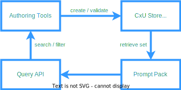
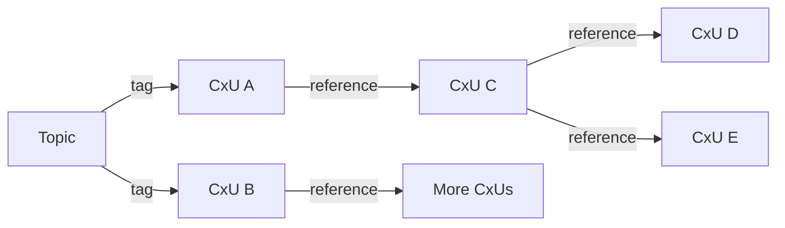

---
authors:
  - jamescbury
date:
  created: 2025-07-22
draft: false
categories:
  - Agentic AI Research
tags:
  - cxu
  - specification
  - architecture
comments: true
---

# The Context Unit Blueprint: Architecture, Validation & Graph Retrieval in Pyrana

*My previous post introduced the idea of Context Units - this is the blueprint.* <!-- more -->

!!! abstract "TL;DR"
    Context Units (CxUs) are immutable, hash-addressed knowledge atoms. This post describes their schema, lifecycle, and the engine that lets you create, validate, version, and retrieve them at scale.

!!! pyrana "Pyrana integration"
    Everything described here is a sneak peak inside of the context engine of **Pyrana**—our context-engineering platform. The lifecycle stages below map to Pyrana micro-services (`authoring-ui`, `doc-extractor`, `cxu-validator`, `content-store`, `query-api`, and `prompt-pack`). If you’re using Pyrana you already have the full CxU toolchain out of the box.

## 1. High-Level Architecture



1. **Authoring Tools** *(Pyrana `authoring-ui`, `doc-extractor`)* – UI forms, document extractors, or API imports create draft CxUs.
2. **CxU Validator** *(Pyrana `cxu-validator` service)* – Enforces schema + higher-order rules (conflict detection, derivability).
3. **CxU Store** *(Pyrana `content-store`)* – Deduplicates via SHA-256 multihash, persists immutable objects.
4. **Query API** *(Pyrana `query-api` GraphQL gateway)* – Filters, sorts, and groups CxUs, optionally producing Merkle-rooted sets.
5. **Prompt Pack** *(Pyrana `prompt-pack` library)* – Serialises selected CxUs (or sub-fields) for downstream LLM calls.

## 2. Canonical Schema (v1.0.0)

```json
{
  "cxu_id": "<multihash>",
  "cxu_object": {
    "claim": "string",
    "supporting_context": "string | object",
    "metadata": {
      "knowledge_type": "axiom | derived | prescribed",
      "claim_type": "definition | hypothesis | requirement | …",
      "keywords": ["string", …]
    },
    "version": {
      "number": "integer",
      "created_at": "ISO-8601 date",
      "created_by": "author id | name",
      "prior_cxu_id": "<multihash> | ''"
    }
  },
  "references": ["url | cid | cxu_id", …],
  "tags": ["string", …]
}
```

!!! note "Why multihash?"
    A multihash embeds the hashing algorithm in the digest, future-proofing the identifier if we ever move beyond SHA-256.

### Field Rules

| Field | Required | Notes |
| --- | --- | --- |
| `claim` | ✔ | Single declarative sentence. |
| `supporting_context` | ✔ | 1-2 sentences; may embed markdown. |
| `knowledge_type` | ✔ | Guides validator rule set. |
| `claim_type` | ✔ | Determines canonical sentence frame. |
| `keywords` | ❌ | Helpful for search; must appear in `claim` or `supporting_context`. |
| `references` | ❌ | External sources **or** other CxU ids. |
| `tags` | ❌ | Derivable grouping labels; no new info. |

## 3. Lifecycle & Version Control

1. **Create** – New CxU → hash generates `cxu_id`.
2. **Update** – Author clones object, edits, increments `version.number`, sets `prior_cxu_id`, saves → new hash.
3. **Propagate** – Engine rewrites incoming references pointing to the old `cxu_id`.
4. **Audit** – Version chain is a linked list; diffs are stored for transparency.

!!! info "Content-addressability unlocks portability"
    Because every CxU’s ID **is its hash**, you can store the same object in anything from IPFS to an S3 bucket keyed by `cxu_id`—or as a node in Neo4j/JanusGraph. The digest guarantees byte-level deduplication and lets heterogeneous systems reference the unit without a central registry.

!!! success "Immutability by design"
    Old versions remain read-only. Deleting a CxU only removes the pointer; the hash history is still provable.

## 4. Validation Engine

The validator applies two stacks of checks:

1. **Schema Validation** – JSON-schema enforcement.
2. **Semantic Rules** – Domain logic, e.g. *“tags must be derivable from content”* or *“axioms cannot reference derived CxUs.”*

Rules are declarative JSON expressions and version-controlled alongside the code so that past validations are reproducible.

### Beyond Schemas: Policy-Precedence Rules

Unlike a typical JSON-schema check, a *semantic rule* can look at **multiple** CxUs at once and decide whether they coexist peacefully. A common use case is enforcing the **precedence hierarchy** that exists in many organisations:

1. *Corporate Policy*  ➜ highest authority
2. *Standard Operating Procedure (SOP)*
3. *Work Instruction*  ➜ lowest authority

If two claims conflict, the validator must keep the higher-precedence unit and quarantine the other for review.

```jsonc
// excerpt from pyrana/validator/policy_precedence.rule.json
{
  "rule_id": "policy-precedence-v1",
  "description": "Reject or quarantine lower-precedence CxUs that contradict higher-level documents",
  "applies_to": { "metadata.claim_type": ["policy", "sop", "work_instruction"] },
  "precedence": ["policy", "sop", "work_instruction"],
  "conflict_logic": {
    "type": "json-logic",
    "expression": {
      "and": [
        {"==": ["${claim}", "${other.claim}"]},
        {"<": ["${precedence_rank}", "${other.precedence_rank}"]}
      ]
    }
  },
  "on_violation": "quarantine_lower_precedence"
}
```

**Walk-through**

1. Validator groups incoming CxUs by normalised `claim` text.
2. For each group it assigns a numeric rank based on `claim_type`.
3. If two versions clash, the one with the *higher* rank (smaller number) is accepted; the other is flagged with status `quarantined` and a helpful message:

```text
⚠ SOP-123 contradicts Corporate-Policy-42. Move to draft or update claim wording.
```

Because rules are data files, teams can review them in pull requests and roll back to earlier rule sets when auditing past ingestions.

## 5. Retrieval, Filtering & Set Creation

API supports:

* `filter`: tags, authors, date range, knowledge_type, claim_type
* `sort`: created_at, claim alphabetic, relevance
* `fields_to_return`: e.g., `["claim"]` for prompt efficiency
* `save_as_set`: builds deterministic Merkle root over ordered `cxu_ids`

!!! info "Why Merkle trees?"
    They allow independent parties to verify that a retrieved set hasn’t been tampered with — essential when sharing context across trust boundaries.

### Sets as Graphs

Saving a list of `cxu_ids` is only the **first** step. Inside **Pyrana** each saved set also lives in a lightweight **graph database**. Tags and explicit `references` turn your list into a network where every hop explains *why* two ideas belong together.



In the UI you can click any node to chase its chain of reasoning. The API lets you ask for:

* `depth=n` – return all CxUs within *n* hops of a starting node
* `confidence>0.7` – filter by how often a unit helped produce correct answers

### Growing Stronger with Use

Every time a set guides an LLM or a human to a **correct** prediction, Pyrana bumps a *confidence score* on the units **and** the links they travelled. Think of it like “likes” for knowledge:

* Units that prove useful more often float to the top of search results.
* Weak or unused links fade, highlighting them for review or retirement.

Over time your graph focuses on the beliefs that actually work in practice—turning static documentation into an adaptive prediction engine.

## 6. Import / Export

* **Import** – `.json`, `.csv`, or Markdown files with front-matter.
* **Export** – Same formats + optional Merkle root, proofs, and diff metadata.
* Idempotent: re-importing an exported set yields zero new hashes.

## 7. Example Workflow

1. **Researcher** drops a PDF into the extractor.
2. Extractor produces 42 candidate CxUs → validator runs.
3. 38 pass; 4 need human fixes → manual form edits them.
4. Approved CxUs are hashed and stored.
5. SME queries `tag=scm risk` & `fields=["claim","cxu_id"]` → gets 12 CxUs, saves as set `supply-risk-v1`.
6. LLM prompt includes those 12 claims + `supply-risk-v1` Merkle root.
7. Output references `cxu_ids`; auditors trace answers back to original PDF.

## 8. Open Questions

!!! question "When is a tag *not* derivable?"
    We’re exploring NLP heuristics that can propose tags automatically and then verify derivability rather than relying on authors to think about it.

!!! warning "Hash collisions"
    While practically unlikely with SHA-256, the design still treats a collision as a critical alert and halts ingestion to prevent poisoned graphs.

## 9. Authoring Templates & Best Practices

The following **starter templates** cover most early projects. They’re not exhaustive - we are adding new ones as Pyrana expands into other domains.

### 9.1 Definition / Axiom

Use this when you are pinning down *what something is* or stating a timeless first principle.

```jsonc
{
  "cxu_object": {
    "claim": "In Scrum, a Sprint is a time-boxed iteration of one month or less.",
    "supporting_context": "From the 2020 Scrum Guide — applies to all Scrum implementations.",
    "metadata": { "knowledge_type": "axiom", "claim_type": "definition" }
  }
}
```

Guidelines: single predicate; present-tense; no conditions.

### 9.2 Causal / Hypothesis

Ideal for statements that *could* be falsified.

```jsonc
{
  "cxu_object": {
    "claim": "If onboarding is < 2 clicks, then trial-to-paid conversion rises by ≥10 % in B2B SaaS.",
    "supporting_context": "Conclusion from 3-month A/B test across 1 200 sign-ups.",
    "metadata": { "knowledge_type": "derived", "claim_type": "hypothesis" }
  }
}
```

Guidelines: explicit *If/Then* framing; include scope where possible.

### 9.3 Goal / Intent (User Story)

Captures why a user (human or agent) cares about an outcome.

```jsonc
{
  "cxu_object": {
    "claim": "As a site-reliability engineer, I need alert noise below 5 % so that I can triage incidents within 2 minutes.",
    "supporting_context": "Aligns with SLA-99.9 % objective approved in Q3 OKRs.",
    "metadata": { "knowledge_type": "derived", "claim_type": "requirement" }
  }
}
```

### 9.4 Checklist for a Well-Written CxU

| Test | Ask yourself… |
| --- | --- |
| **Atomicity** | Can I split this into two truths? If yes—split it. |
| **Clarity** | Would a peer interpret the same meaning without extra context? |
| **Tagging** | Are all tags derivable from `claim` or `supporting_context`? |
| **Template fit** | Does the wording match a known template or do we need a new template? |
| **Verifiability** | Can evidence be cited (now or later) to prove or refute it? |
| **Scope stated** | Is the domain or audience obvious (e.g. “In EU-region…”)? |
| **No hidden references** | The claim stands alone even if external links break. |

Run this list before committing; Pyrana’s authoring UI surfaces it as an inline linter.

## Conclusion

CxUs give us a trustable foundation for high-density, auditable context. With the schema, validator, and version control in place, the next milestones are smarter extraction and richer set operations. Contributions welcome — just remember, one truth per hash.

<!-- BLOG_GIT_METADATA START -->

<div class="blog-git-metadata" style="margin-top: 2rem; padding-top: 1rem; border-top: 1px solid var(--md-default-fg-color--lightest);">
  <details style="background: var(--md-code-bg-color); padding: 0.5rem 1rem; border-radius: 0.2rem;">
    <summary style="cursor: pointer; font-weight: 500; color: var(--md-default-fg-color--light);">
      📝 Content Provenance
    </summary>
    <div style="margin-top: 1rem; font-size: 0.9em;">
      <p style="margin: 0.5rem 0;"><strong>Created:</strong> 2025-07-23</p>
      <p style="margin: 0.5rem 0;"><strong>Last Modified:</strong> 2025-07-23</p>
      <p style="margin: 0.5rem 0;"><strong>Total Revisions:</strong> 1</p>
      <p style="margin: 0.5rem 0;"><strong>File SHA-256:</strong> <code style="font-size: 0.85em;">a9c09a1393f892a9...</code></p>
      
      <div style="margin-top: 1rem;">
        <p style="margin: 0.5rem 0; font-weight: 500;">Recent Changes:</p>
        <table style="width: 100%; font-size: 0.85em; margin-top: 0.5rem;">
          <thead>
            <tr style="border-bottom: 1px solid var(--md-default-fg-color--lightest);">
              <th style="text-align: left; padding: 0.25rem;">Date</th>
              <th style="text-align: left; padding: 0.25rem;">Author</th>
              <th style="text-align: left; padding: 0.25rem;">Change</th>
            </tr>
          </thead>
          <tbody>
            <tr>
              <td style="padding: 0.25rem;">2025-07-23</td>
              <td style="padding: 0.25rem;">James Canterbury</td>
              <td style="padding: 0.25rem;">Added CxU posts and custom Admonitions</td>
            </tr>
          </tbody>
        </table>
      </div>
      
      <p style="margin-top: 1rem; margin-bottom: 0;">
        <a href="https://github.com/zeroth-tech/blogs/blob/b9419ce5299242a41df9572414a7e2e6dd8eecf8/docs/posts/CxU_blueprint.md" target="_blank" style="color: var(--md-primary-fg-color); text-decoration: none;">
          View Full History on GitHub →
        </a>
      </p>
    </div>
  </details>
  
  <div style="margin-top: 0.5rem; font-size: 0.8em; color: var(--md-default-fg-color--lighter);">
    <p style="margin: 0;">
      <em>This metadata provides cryptographic proof of this document's creation and modification history. 
      The SHA-256 hash can be used to verify the document's integrity, while the Git history shows its evolution over time.</em>
    </p>
  </div>
</div>

<!-- BLOG_GIT_METADATA END -->

