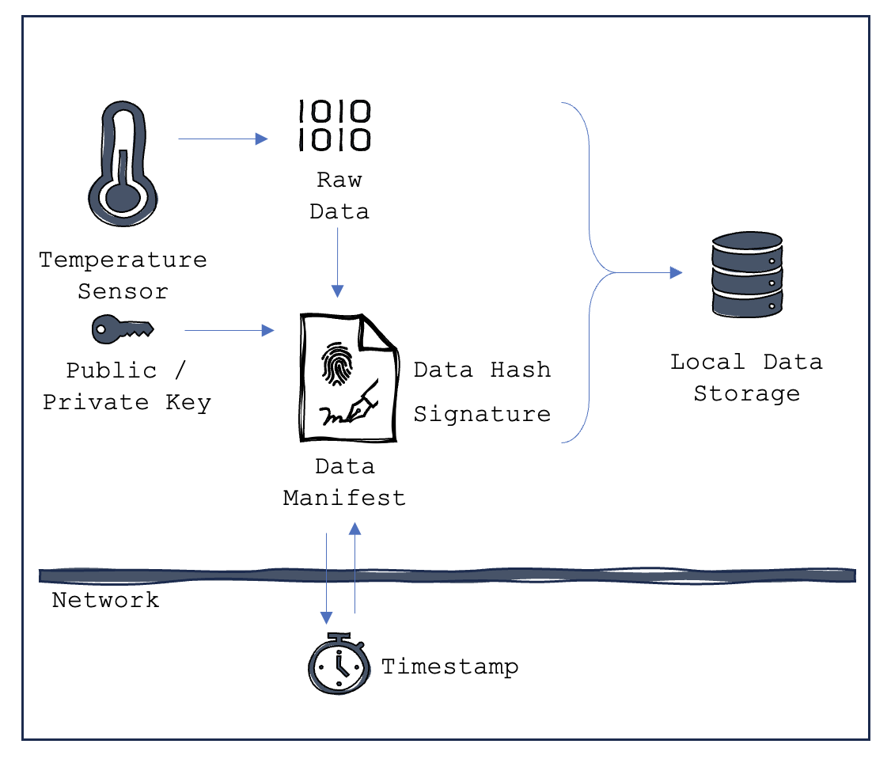
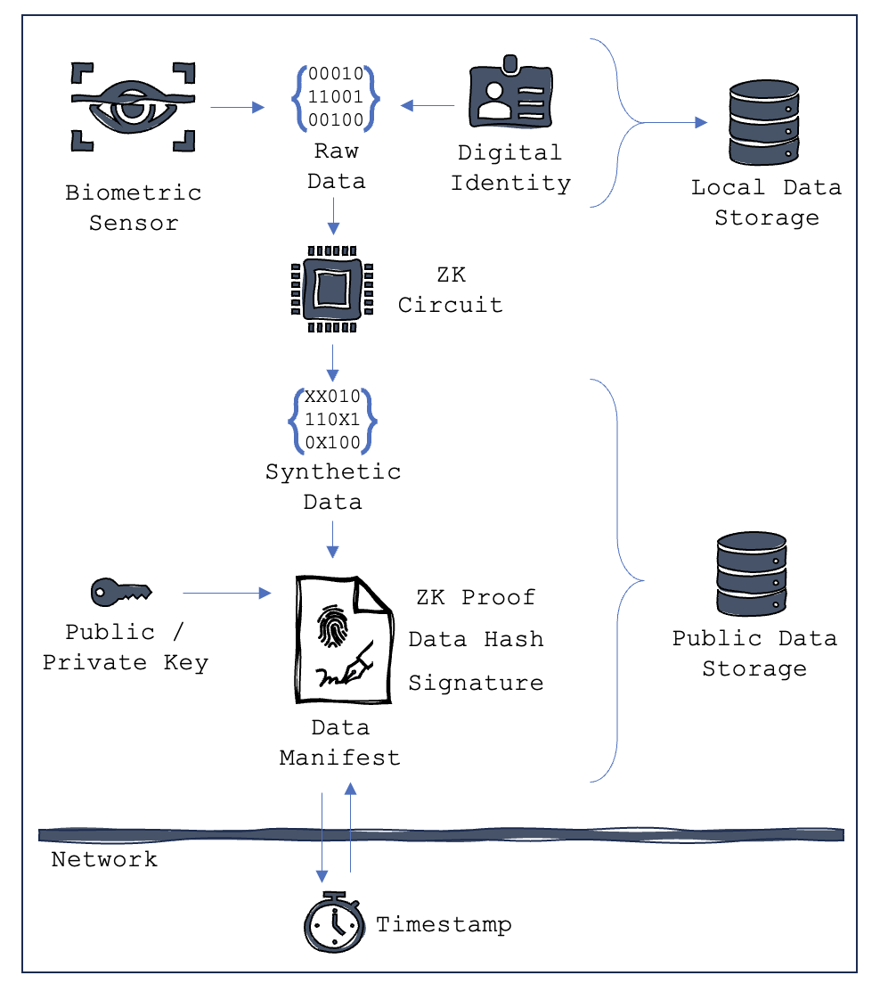
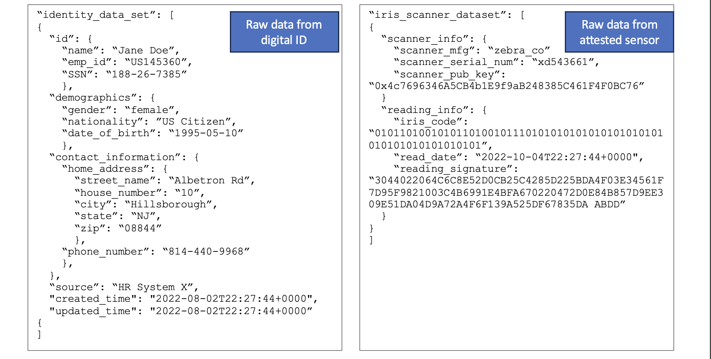
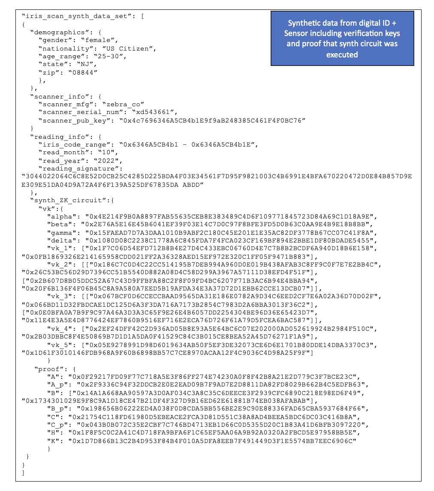

---
authors:
  - jamescbury
date:
  created: 2023-10-10
  updated: 2023-11-29
draft: false
categories:
  - Identity & Authenticity
tags:
  - attested sensors
  - hardware
comments: true
---
# Attested Sensors & Source Data Synthesis Under Zero Knowledge

TLDR; attested sensors can be used to digitally sign source data at the moment it is collected by a IOT device.  Blockchain can be used to notarize that signature and apply a tamper proof time stamp.  To protect sensitive data from leaving the source, a zero knowledge_  _circuit can be used to produce a synthesis of the raw data and generate a proof that the synthesis was done correctly._

<!-- more -->

Securing data at the point of origin and delivering data providence throughout its lifecycle is a key component of data integrity.  Assuming that data will travel across multiple systems/networks it is important to develop methods that can travel with the data and independently attest to its source attribution and immutability.  _Note that attesting to the validity of the data in the first place is a separate issue of configuration and physical control._

Sensors are hardware that capture evidence or take measurements in the real world and produce a digital output.  An example is a digital thermometer that will measure the ambient temperature of its surroundings and provide output data on a periodic basis.  Another example is a digital photo that captures an image through a lens and produces an array of colored pixels that can be used to render the image in digital media.  Still another example a biometric sensor that can read a human iris or fingerprint and return a digital identifier for that individual.

Attested sensors are sensors that have additional hardware which contains a public/private key pair, the public key being a universal identifier for the sensor.  When the sensor takes a reading (or a photo for example) the private key is used to sign the digital output of the sensor.  This typically includes a hash of the data itself plus an encryption that can only be produced with the private key but can be easily verified by anyone that knows the public key.  The hardware must be carefully designed so that there is no option to alter the source data prior to the signature being generated.  Coupling the sensor with a network protocol, such as a blockchain, can serve to provide a time stamp for the signature and to store the data hash in an immutable database; this coupling requires internet connectivity for the sensor.

Subsequent changes to the data must be handled through careful orchestration of software and permissions to develop a ‘manifest’ that tracks all alterations in the form of a change log.  The work currently being done by CP2A.org is an example of what must be done to ensure edited copies of digital photos are legitimate and attributable.  While not as prominent outside of photography, video, and audio, a similar ‘manifest’ approach could be applied to any sensor reading.

Through the function of registering the public key of the sensor to a network (likely the same network used for time stamping and notarization of the data) it is later possible to attribute data back to its source, if the data is to be used as part of a training population for machine learning this is critical component to ensuring data authenticity (and possibly deriving percent attribution which may be used for calculating royalties).

Figure 1: Attested sensors with timestamping and signatures

## Data Capture with Synthetic Data

Some sensors will inherently capture data that is considered sensitive or ‘Personally Identifiable Information’ (PII) such as biometric scanners – while the scanner itself may not capture PII, the function of coupling that data with an established identity would.  In general, any sensor data may be coupled with non-sensor information such as identity, location, etc. It is that correlation between several data elements that makes the dataset useful; but this dataset also creates privacy concerns.

An attested sensor with data synthesis capabilities generates both a raw data set and a synthesized data set for each reading.  The sensors synthesis circuit anonymizes the PII from the raw data using a zero knowledge cryptographic circuit which accepts the raw data as input and generates a synthesized data set in addition to a cryptographic proof which is signed by the attested sensor.

In this method we are pushing the synthesis of data out to the edges of the network by generating it at the source.  This then allows the synthetic data to be aggregated for model training without the risk of sensitive data leakage.  The source data can then be encrypted and stored locally in a secure manner, or possibly destroyed.

Figure 2: Attested sensors with data synthesis

Example 1: Converting raw data sets to synthetic data set

There may be an alternate way of writing the synth circuit then flashing it onto some non-volatile memory in the sensor, it could be part of the attestation process…

But then again ZKPs are cool.

<!-- BLOG_GIT_METADATA START -->

  

    

      📝 Content Provenance
    

    

      
<strong>Created:</strong> 2024-06-15

      
<strong>Last Modified:</strong> 2025-09-19

      
<strong>Total Revisions:</strong> 8

      
<strong>File SHA-256:</strong> <code style="font-size: 0.85em;">580ffaf0c114a7b8...</code>

      
      

        
Recent Changes:

        <table style="width: 100%; font-size: 0.85em; margin-top: 0.5rem;">
          <thead>
            <tr style="border-bottom: 1px solid var(--md-default-fg-color--lightest);">
              <th style="text-align: left; padding: 0.25rem;">Date</th>
              <th style="text-align: left; padding: 0.25rem;">Author</th>
              <th style="text-align: left; padding: 0.25rem;">Change</th>
            </tr>
          </thead>
          <tbody>
            <tr>
              <td style="padding: 0.25rem;">2025-09-19</td>
              <td style="padding: 0.25rem;">James Canterbury</td>
              <td style="padding: 0.25rem;">Added the github "Content Provenance" onto each...</td>
            </tr>
            <tr>
              <td style="padding: 0.25rem;">2024-06-15</td>
              <td style="padding: 0.25rem;">James Canterbury</td>
              <td style="padding: 0.25rem;">added a bunch of old blogs...</td>
            </tr>
          </tbody>
        </table>
      

      
      

        <a href="https://github.com/zeroth-tech/blogs/commits/main/docs/posts/attested_sensors.md" target="_blank" style="color: var(--md-primary-fg-color); text-decoration: none;">
          View Full History on GitHub →
        </a>
      

    

  

  
  

    

      <em>This metadata provides cryptographic proof of this document's creation and modification history. 
      The SHA-256 hash can be used to verify the document's integrity, while the Git history shows its evolution over time.</em>
    

  

<!-- BLOG_GIT_METADATA END -->

