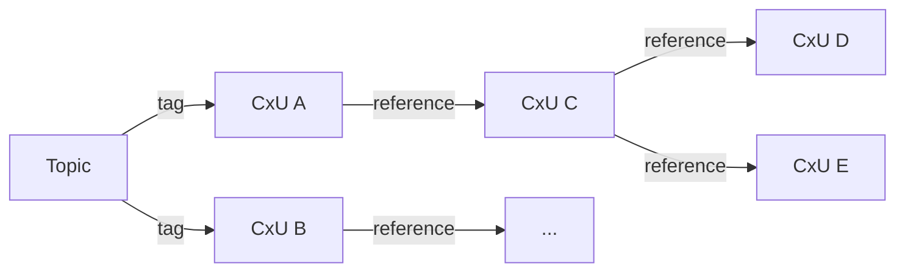

---
authors:
  - jamescbury
date:
  created: 2025-07-04
draft: true
categories:
  - Fundamentals
tags:
  - context units
  - knowledge
  - prediction
  - content-addressable
comments: true
---
# Building Your Worldview with Context Units

We used to joke that it didn't matter what you said, as long as you say it with confidence— and a dramatic hand slap on the table could sometimes make everyone else "believe" you must be correct.  Humans are funny like this—it doesn't take much for us to accept something as truth, especially if:

+ comes from a source that we don't distrust (I'm choosing my words carefully here - we don't always need to trust the source; rather, we just need reasons not to distrust it)
+ it sounds credible - that is to say it fits within our preconceived notion of the world, aka our *worldview*.

<!--more-->

That last point is interesting to me.  I enjoy most of Scott Adams's work—Dilbert does a great job of poking holes in the veil of our worldview.  Mr. Adams likes to write about our "mental filters" and how the best ones (at least from the perspective of the individual) are the ones that "help you predict the future and make you happy".

The "mental filter" is an interpreter for our worldview.  When making decisions we receive new information, pass that information through our filter, make predictions on what the outcomes of various actions might be, select the action that makes us happy, act, wait, learn, repeat.  The more often we are *correct* in our predictions the more confident we are in making future similar predictions.  When others notice that we are particularly good at predicting they tend to trust our judgement and suddenly we are experts.  But the reality is that our worldview is a messy pile of experience, half-digested readings or case studies, and "odds and ends" of facts that have been stuck in our heads since we were kids.

And now we are asking agents to apply our mental filters for us to make better predictions that fit our worldview and reinforce everything we want to believe is true.  For this to work we need to do a better job of structuring our worldview in the first place.  Enter **Context Units**—tiny, immutable packets of knowledge that can be composed into a coherent worldview you can inspect, version, and share.

!!! note "Fast Definition"
    A **Context Unit (CxU)** is a small, standalone object that captures one statement you believe is true (or are considering), its supporting evidence, and rich metadata.  As our worldview changes so do our CxUs, therefore they require a form of version control - as such;
    Each CxU is content-addressable: its ID is a cryptographic hash of the object's data, making every version tamper-evident and easy to track.

## Why This Matters Now

We are flooding LLMs with gigabytes of PDFs hoping they magically adopt our perspective. We are asking the algorithm broad based questions on topics that are outside of our worldview but giving it just enough context so that the response fits our worldview.  Spoiler alert — while this may work sometimes, it wont work all the time.  Just because you have a book on your shelf does not mean you understand the content - but it might make you look smarter.  Context Units force us (and our machines) to break knowledge into bite-sized, verifiable pieces *that we understand*.  They cut through the fluff of large texts and show how one piece of knowledge relates to another and (if done correctly) map to our scientific thinking of basing our mental filters on a series of axioms or first principles.

## Anatomy of a CxU

There's nothing better than a self-referential example... Let's peel back the layers of a real CxU based on the contents of this post (keep in mind that this is my personal truth - you may or may not agree with it, and I may change my mind in the future):

```json
{
  "cxu_id": "12209c8e4d2f7b1a3e6f8d5c2a9b4e7f1c6d8a3b5e9f2c7d4a1b8e5f3c9d6a2b7e4f",
  "cxu_object": {
    "claim": "Context units represent a singular truth from the perspective of an individual or group.",
    "supporting_context": {
      "summary": "Zeroth Technology established the idea of CxUs as atomic knowledge units while building the Pyrana platform and presented this idea in various blog posts.",
      "evidence_type": "derived"
    },
    "metadata": {
      "claim_type": "definition",
      "hierarchy": "fundamental belief"
    },
    "version": {
      "number": "1",
      "created_at": "2025-07-03",
      "created_by": "Jamescbury",
      "prior_cxu_id": ""
    }
  },
  "references": ["placeholder for this article", "https://zeroth-tech.github.io/blogs/2025/06/18/the-role-of-content-addressability-in-context-units-building-distributed-knowledge-systems/"],
  "confidence": 0.9,
  "tags": ["context unit", "knowledge", "thinking"]
}
```

!!! info "Three Properties to Remember"
    1. **Immutable:** The `cxu_id` is a hash of the `cxu_object` change the object and you have a new CxU.  
    2. **Versioned:** A change doesn't a doesn't overwrite the old; it creates a new CxU and increments the version.  
    3. **Relational:** CxUs can reference external sources or other CxUs; however, the references are kept outside of the `cxu_object` to allow for a more fluid flow of knowledge.  This of course introduces some challenges and requires us to "maintain" our CxUs as discussed below, but it opens a wide design space that lets us reinforce, or contradict existing CxUs, and collectively treat them as an evolving knowledge graph.

Because a CxU must "stand on its own" it is important that we provide supporting context within the `cxu_object` this includes:

+ `summary` – one-to-two-sentence human-readable rationale.
+ `evidence_type` – either **axiom** (first-principle belief) or **derived** (grounded in other artefacts).

Derived CxUs are where we begin to build our knowledge graph and can start to trace our "truths" back to first principles. A general rule of thumb is that any given CxU can be traced to an axiom in five or fewer links (this is a reference to the "5 Whys" method of root cause analysis). And it is one "assessment" of the completeness of our CxU set which can turn a loose claim into a visible chain of reasons everyone can inspect.

## From Single Unit to Worldview

One CxU by itself is a factoid on a sticky note. A set of CxUs becomes a **body of knowledge**—a worldview you (or an agent) can query, visualize, and build upon.  The trick is to rapidly create a "specialized" or related body of knowledge that *you* belive is true.  This is done thorugh the metadata tagging - because it's difficult for humans to read a 64 character (68 characters if you are using multi-hash) tagging comes in handy for grouping context units into cohesive sets and subsets.  When interacting with an agent this allows you to feed an ultra-compact set of context that you can easily check the agent against.



### Building Confident Prediction Engines

Knowledge isn't valuable until it helps you predict the future. When your CxU graph guides you to a conclusion that turns out right, the involved units gain confidence weights. Over time your graph evolves into a personal prediction engine, surfacing which beliefs deserve reinforcement and which need re-thinking.  This confidence acts in a way similar to a neural network.  Not only do the individual units gain more strength, but their connections through tagging and references do as well - over time we will find ingrained pathways that reliably lead to correct predictions.

## Keeping It All Straight

CxUs, and their collective body of knowledge follow a lifecycle.  They are initially conceived (either by a first principle or by some external learning) then they evolve by strengthening if they are used to predict outcomes, pruned if they are unused and become stagnant, and modified if they do not predict well or are disproven given additional facts.  The trick for facilitating this lifecycle lies in simple and controlled processes for creating, modifying, and removing CxUs.  Inherent to the design and use of CxUs is the concept of 'Content Addressability' wherein the hash of the `cxu_object` serves as its identifier.  In addition to automatic de-duplication (if you hash the same `cxu_object` twice you will get a collision in the ID) this serves as a handy trick to keep track of which CxU was used and to later prove that its claim or supporting context had not changed (without relying on a separate "system" for version control).  From an audit perspective, an entire set of CxUs can be hashed together in a merkle tree and quickly used to verify that the entirety of the CxU set was passed to the agent for context.  This also allows for the future sharing of CxUs in a programmable nature via decentralised storage solutions and tokenization of distributed networks.

### Conflict Detection

During the creation or modification of a CxU we follow a process to ensure we don't have conflicting perspectives on a given topic or claim (I wish this could be applied to my own thought process).  Because each claim is explicit, conflicting beliefs are easy to spot. If `CxU-A` says "remote teams reduce productivity" and the new `CxU-B` says the "remote teams increase productivity", `CxU-B` is flagged for review.  Depending on the confidence level of `CxU-A`, `CxU-B` may need to be dismissed or require qualification by certain additional criteria - in more robust knowledge bases the agent can likely resolve the conflict itself, but in some cases a human must intervene to be the decider.  Tagging plays an important role in conflict detection - it is only within the same tag that a conflict can be identified and must be resolved.  In the example above `CxU-A` may be valid for the set of context that describes a team brainstorming session; whereas `CxU-B` is valid for a team of academic researchers who work in parallel and can meet virtually.  

!!! warning Avoid tagging that adds information

    Tags must be treated as mechanisims to group CxUs together into sets for the purpose of applying context.  The tag must be clearly derived from the `claim` and the `supporting_context` of the `cxu_object`.  The tag iself cannot be relied upon to "add" information to the CxU as it lies outside of the `cxu_object`.  

    In the example above `CxU-A` should be descriptive enough to determine that it applies to brainstorming (i.e., "productivity is increased when the entire team is present in-person for brainstorming sessions").  And `CxU-B` might better be written as "In areas where parallel work can be applied, such as in academic research, separation of the workers can increase productivity"

### Change Control

Versioning plays an important role in the CxU life-cycle.  Because the `cxu_id` is used as a proof of the `cxu_object` content in audit trails they cannot ever be fully retired (though it is worth noting that a CxU *can* be deleted - the `cxu_id` will remain as an invalid pointer.  This may be necessary when certain PII information is requested to be forgotten).  When a new version of a CxU is created the version number is simply incremented and the `created_at` field is updated with the current time stamp.  The `prior_cxu_id` is populated with the previous version `cxu_id`.  Note that the versioning is within the `cxu_object` and is therefore inherent to the newly created `cxu_id`.  At this point maintenance needs to be run across the current set of CxUs to find any existing references to the `prior_cxu_id` and update those references to the newly created `cxu_id` - it is for this reason that the `references` field is maintained outside of the `cxu_object`.

## The Art of Writing a Good CxU

Most of the time we humans will not be writing CxUs ourselves; in fact LLMs are pretty good at deriving them if you give the right prompt.  Based on our initial research we've found there are patterns for a well written CxU described in the following models

1) **Definition/Axiom Model**

When to use

+ Establishing a *meaning* ("what X is") or a *first principle* accepted as truth
+ Ideal for glossaries, domain ontologies, operating principles, legal definitions, or mathematical axioms

Writing guidelines

| Good practice | Why it matters|
|---------------|---------------|
| Single subject, single predicate | Keeps the unit atomic; avoids two truths in one hash. |
| Present‑tense, timeless wording | Prevents accidental time‑boxing ("will be", "became").|
| No conditions or causal language | Those belong in Hypothesis or Causal models. |
| Universal or scoped qualifier up‑front (e.g. "In Scrum, a Sprint is…") | Removes ambiguity about domain.|

```json
    {
    "cxu_id": "12204a5c32e8636143da74ca6ff9a73aac28c226cd3e1cba35a205fca753fc4528db",
    "cxu_object": {
        "claim": "In the context‑unit framework, a claim is a single declarative statement that can be individually version‑controlled.",
        "supporting_context": {
        "summary": "Defines the core vocabulary term 'claim' used throughout the CxU system design documents.",
        "evidence_type": "axiom"
        },
        "metadata": {
        "claim_type": "definition",
        "hierarchy": "fundamental belief",
        "tags": ["definition","vocabulary","cxu"]
        },
        "version": {
        "number": "1",
        "created_at": "2025-07-07T18:00:00Z",
        "created_by": "Jamescbury",
        "prior_cxu_id": ""
        }
    },
    "references": [],
    "confidence": 1.0,
    "tags": ["definition","cxu"]
    }
```

2) **Causal / Hypothesis Model**

When to use

+ You are asserting a relationship that can in principle be tested or refuted ("If X, then Y").
+ Appropriate for product assumptions, scientific hypotheses, causal beliefs, business rules ("Raising prices by ≥5 % will decrease churn by ≤1 %"), or risk models.

Writing guidelines

| Guideline | Detail |
|-----------|--------|
| Explicit condition → outcome structure | Use "If/When [condition], then [observation/outcome]".|
| Include "because" … optional | Adds rationale but keep it short; extended reasoning belongs in supporting_context. |
| Falsifiability checkpoint | Ask "Can I imagine evidence that disproves this?"—if not, it's likely a Definition or Principle, not a Hypothesis. |
| Specify scope | e.g. "For remote‑first software teams with ≥50 members…" |

```json
{
  "cxu_id": "1220745c1a6edb5e6c23ef489d9faa3ec6907f02a105115683348511e4a1732c0dd9",
  "cxu_object": {
    "claim": "If a knowledge graph contains fewer than five hops between a derived CxU and its nearest axiom, then retrieval latency for explanatory chains stays under 200 ms on a standard vector store.",
    "supporting_context": {
      "summary": "Derived from load‑test results on the Pyrana demo graph (≈10 K CxUs).",
      "evidence_type": "derived"
    },
    "metadata": {
      "claim_type": "hypothesis",
      "hierarchy": "operational belief",
      "tags": ["performance","graph-depth","latency"]
    },
    "version": {
      "number": "2",
      "created_at": "2025-07-07T18:03:00Z",
      "created_by": "Jamescbury",
      "prior_cxu_id": "122082d683f42569814e4771e6e9b8e1d43750b861104669bb60e6902ebaba4ee7ce"
    }
  },
  "references": ["cid://perf-test-report-2025-06-28"],
  "confidence": 0.7,
  "tags": ["performance","graph-depth"]
}
```

3) **Goal/Intent (User-Story) Model

In some ways CxUs are user requirements that are used to tell an agent what to do in a certain circumstance or that describe the desired outcome of a given scenario.  Here we can team the CxU like a user story.

When to use

+ Capturing *user intent*, requirements, OKRs, or design constraints that drive work.
+ Bridges human purpose to system capabilities - helpful wne the CxU set feeds backlog generation or agent planning.

Canonical sentence frame

"As a [role/persona], I [need/want/must][capability] so that[business value / outcome]."

Writing guidelines

1. Keep the role specific – "Site‑reliability engineer" beats "user".
2. Use need (mandatory) vs want (nice‑to‑have) – clarifies priority.
3. Outcome describes value, not another action – e.g. "so that we meet SLA‑99.9 %" not "so I can restart servers".
4. Avoid conjunctions – split compound desires into separate CxUs.

```json
{
  "cxu_id": "<sha-256…>",
  "cxu_object": {
    "claim": "As a data‑room administrator, I need every document link to expire automatically after 48 hours so that investor access remains time‑bound and we satisfy SOC‑2 control 3.4.",
    "supporting_context": {
      "summary": "Maps directly to control  SR‑3 in our SOC‑2 gap analysis and was requested by compliance.",
      "evidence_type": "derived"
    },
    "metadata": {
      "claim_type": "requirement",
      "hierarchy": "tactical belief",
      "tags": ["security","expiration","soc2"]
    },
    "version": {
      "number": "1",
      "created_at": "2025-07-07T18:06:00Z",
      "created_by": "Jamescbury",
      "prior_cxu_id": ""
    }
  },
  "references": ["gdoc://soc2-gap-analysis#SR-3"],
  "confidence": 0.9,
  "tags": ["security","requirement"]
}
```

a well written CxU will pass these tests:

| Test | Question to ask yourself |
|------|--------------------------|
| Atomicity | Could I sensibly split this into two independent truths? — if yes, rewrite. |
| Clarity | Would a peer in the domain interpret this the same way without extra context? |
| Tagging | Can the `tags` be derived from either the `claim` or the `supporting_context`? |
| Consistency with CxU structure | Does the claim follow a known CxU model? |

### Some final advice on the development and use of CxUs

1. Choose one canonical sentence frame for each claim_type and enforce it with linting scripts or a VS Code snippet; that keeps hashes stable and parsing easy.
2. Err on the side of more CxUs—splitting coarse truths early avoids painful refactors later.
3. Review conflicts tag‑by‑tag, not database‑wide, to keep reconciliation human‑scale.

## Conclusion: A New Habit of Thought

For millennia psychologists and philosophers have been trying to decode how we think. Now we are faced with a new technology in the form of AI that is holding up a mirror to our messy scattered thought process.  We hold a very high bar up for the agents, but we have served them a spaghetti platter of half-thoughts to learn on - and many times those learnings are not things which we ourselves understand (or even agree with!).  

CxUs are a chance to get our housekeeping straight and to make sure that our beliefs, maxims, first principles, values (whatever you want to call them) are accurately and completely represented in the context of any given prompt to any given model now or in the distant future.  We don't expect to be able to convert the entirety of human knowledge into context units - we don't even think a single individual's thoughts could be completely captured.  But we do think it's a start and it can become a snowball that keeps growing as it rolls.  Some careful planning now with how we structure our context, how we store it, and share it will be a strong investment in our collective future.
