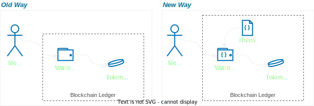
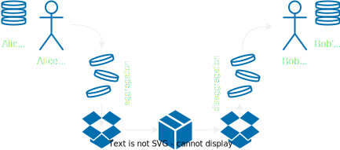
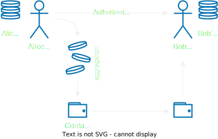

---
authors:
  - jamescbury
date:
  created: 2024-07-22
draft: false
categories:
  - Supply Chain
tags:
  - tokenization
  - supply chain
comments: true
---
# Contract Wallets as Containers

There are interesting things happening with account abstraction, but one function I haven’t heard much about is transferring the ownership of a wallet from one user to another.  There are a bunch of use cases where this could be useful, I'd like to share my thoughts on how this effects supply chain.

<!-- more -->

## A bit of background
Account Abstraction (enabled by ERC-4337) lets us expand the usage of wallets in many ways.  There are some great primers out there on ERC-4337; the best source (as usual) is the [ethereum.org page](https://ethereum.org/en/roadmap/account-abstraction/) on the topic.  But for our purposes let’s just say that in the past we interacted with the Ethereum network using Externally Owned Accounts (EOAs) which were public addresses that we controlled with our private keys - if you have access to the private keys you can do *anything* with the assets held by that EOA.  Contract Wallets under ERC-4437 let us create rules that control how the wallet can interact with tokens and how users can interact with the wallet.  This lets us do all kinds of cool things around social recovery, gas-less transactions, multi-signature transactions, etc. - I do think the primary benefit of account abstraction will be the enhanced safety and usability of wallets.  But ERC-4337 also introduces the concept of “authorized controllers” (which are likely to be good old fashioned EOAs, but can also be other contract wallets) and bundled transfers which let us move many assets in one transaction.  For the purposes of this post lets assume all assets are represented by tokens which are held in wallets (accounts) which are controlled by people.

In a EOA world if for some reason I wanted to transfer custody of all the tokens in my wallet to someone else I would have to transfer them one by one to that persons account, that could be a lot of transaction fees.  Of course I could just give them my private keys. But this isn’t really giving them custody… the keys would still work for me, it’s just sharing access.  And it’s really stupid and insecure.  

## Wallets as Containers

There are many cases where we might want to transfer an entire portfolio of digital assets from one person to another without having to move the assets one by one. I’m using the word person here to be familiar, but this is more likely business to business, or entity to entity transaction.  This isn't to be confused with bundled transfers (another use case under ECS-4337 where we can optimize the transfer of many assets by bundling them together); bundled (or batch) transfers are important to our use case, but we want the *container itself to hold a state*.  This last statement will become more clear as we dive deeper.

My background is in pharma supply chain, we spend a lot of time talking about aggregation and disaggregation.  This is when you put stuff in a box and put boxes on a pallet and then send the pallet downstream in your supply chain.  It's pretty rare that the "physical handling" steps of a supply chain deal with individual units.  In previous attempts to recreate supply chain transactions on blockchains we would tackle this by creating "container tokens" - NFTs (usually ERC-721s) would be minted to represent the "stuff" and a separate token would be minted to represent the container.  These would all be initially owned by a single EOA (let’s call them Alice Corp).  Alice Corp would then "map" the stuff NFTs to the container NFT to create the aggregation, then she would transfer the container NFT to Bob Corp.  In theory, Bob Corp was now the proud owner of all the stuff in the container... 

But it didn't really work well so well... To map the individual stuff tokens to Bob Corp we would need to transfer them individually and so this actually made the introduction of the "container token" a bit of un necessary overhead.  When we consider the fact that we generally put containers within containers (items in a carton, cartons in a box, boxes on a pallet, etc) and this adds even more levels of overhead.  Oh, and we also need to dis-aggregate, or unpack the pallets and boxes and repack them with different stuff.  This is usually what wholesalers do and is one of the biggest contributors to "opaque supply chains".

!!! NOTE 
    It's worth noting here that GS1.org has done a ton of work in defining supply chains using a core business vocabulary in [CBV 2.0](https://www.gs1.org/standards/epcis).  One important, if not niche, distinction in aggregation is the usage of "associations" where the container is reusable and carries a history of it's own - I like the example of finishing whiskey by aging it in used red wine barrels... the container leaves a lasting imprint on the product, versus the box that you might store the bottles of whiskey in after they are finished.

**Container tokens don't work.  But maybe container wallets can.**

In supply chain we are primarily concerned with managing the "state" of products as they move through their lifecycle.  We think of state as the changing of relationships between entities (accounts) and products - in other posts we've discussed how this takes the form of claims on tokens.  But we didn't really solve for aggregation and the fact that supply chain events (the transition of state) almost always occur an an aggregate level.  Containers have state and that state needs to be associated to all of the assets within that container at a given point in time.  Container tokens require extensive mapping, but container contract wallets, enabled by ERC-4337, can facilitate this by letting us store additional attributes (and apply logic) within the wallet.

From here it's not too far of a stretch to use the container wallet as the method for embedding rights over the assets it contains - this has the potential so solve for the multiple claims of regulatory seizure (the right of a regulator to seize custody of an asset) or fiscal liens (the right of a bank to seize ownership of a financed asset).  Account abstraction allows us to embed many different logical functions into the wallets that hold our stuff...  They might even aid in our ability to transition state confidentially - though that is a topic for another post.
